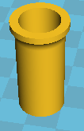

Переходник ножки для полки
----------------

Полка в туалете недостаточно высока, приходится дополнительными трубами 
удлиннять ее ножки. Данная модель используется как крепеж-переходник 
между разными диаметрами ножек и трубок

